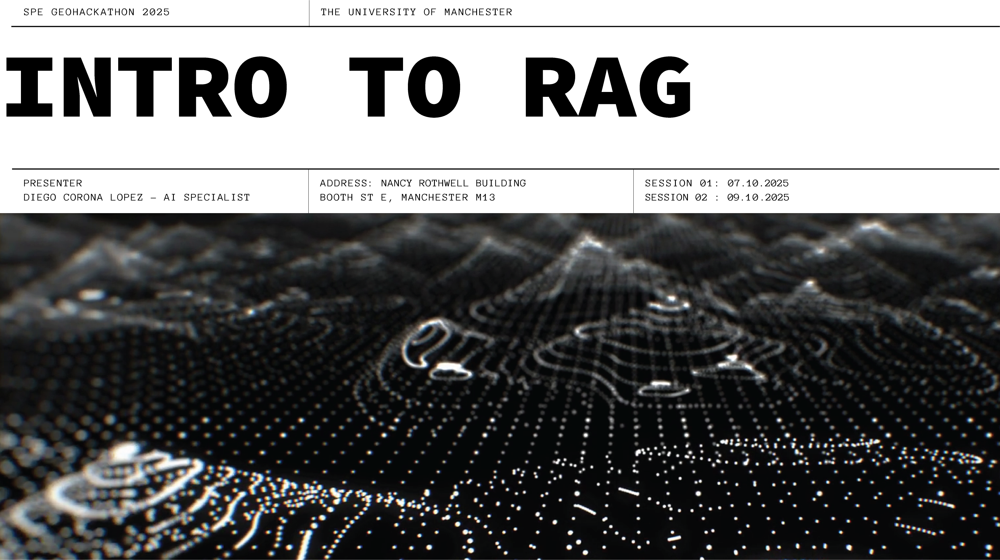

# SPE GeoHackathon 2025 – Bootcamp on LLMs and RAG for Geosciences

Welcome to the SPE GeoHackathon 2025 Bootcamp repository. This repo contains hands-on notebooks, lightweight helper utilities (`spe_utils`), and visual aids for learning how to apply Large Language Models (LLMs) and Retrieval-Augmented Generation (RAG) to geoscience workflows.

---

## Overview
Through structured sessions you will progress from foundational LLM usage (prompting & inference) → tooling & orchestration (LangChain, agents) → Retrieval-Augmented Generation (RAG) → advanced multi-tool/agent patterns. Examples reference subsurface / energy-domain text passages to ground the techniques in realistic geoscience contexts.

### What You'll Learn
- Fundamentals of LLMs & tokenization
- Using Hugging Face Transformers for inference (CPU vs GPU considerations)
- Prompt engineering patterns (system + few-shot + tool-oriented prompts)
- Building basic chains & tools with LangChain
- Constructing and evaluating a domain RAG pipeline (chunking, embeddings, vector search)
- Adding interactivity via Gradio (UI for experimentation / agent playground)
- Designing multi-tool / guarded agents & safe tool execution
- Managing model + embedding model tradeoffs (latency, context length, domain adaptation)
- Accessing gated frontier models (e.g. Llama 3.x) and licensing considerations

---

## Repository Structure
```
spe_utils/        # Helper package: data texts, visual aids, simple agent scaffolds
assets/           # Images used in slides / README
slides/           # (If provided) Slide material supporting the sessions
*.ipynb           # Training notebooks (see table below)
```

---

## Notebook Index
Each notebook can be launched directly in Google Colab (recommended) using the badges below. If a badge fails (e.g. branch rename), open the notebook manually in Colab and select the `dev` or `main` branch.

| Session | Notebook | Focus | Launch |
|---------|----------|-------|--------|
| S1 M1 | `S1_M1_LLM_HF.ipynb` | Intro to LLMs, HF inference, tokenization basics | [](https://colab.research.google.com/github/CLDiego/SPE_GeoHackathon_2025/blob/dev/S1_M1_LLM_HF.ipynb) |
| S1 M1 (Exercise) | `S1_M1_Exercise_Solution.ipynb` | Practice prompts & generation exercises (solutions) | [](https://colab.research.google.com/github/CLDiego/SPE_GeoHackathon_2025/blob/dev/S1_M1_Exercise_Solution.ipynb) |
| S1 M2 | `S1_M2_LangChain.ipynb` | LangChain basics: chains, tools, memory | [](https://colab.research.google.com/github/CLDiego/SPE_GeoHackathon_2025/blob/dev/S1_M2_LangChain.ipynb) |
| S1 M3 | `S1_M3_GradioAgent.ipynb` | Gradio agent UI & tool calling | [](https://colab.research.google.com/github/CLDiego/SPE_GeoHackathon_2025/blob/dev/S1_M3_GradioAgent.ipynb) |
| S2 M1 | `S2_M1_RAG.ipynb` | Retrieval-Augmented Generation pipeline (embeddings, vector DB) | [](https://colab.research.google.com/github/CLDiego/SPE_GeoHackathon_2025/blob/dev/S2_M1_RAG.ipynb) |
| S2 M2 | `S2_M2_Advanced_agents.ipynb` | Advanced agent patterns: multi-tool, guarded exec | [](https://colab.research.google.com/github/CLDiego/SPE_GeoHackathon_2025/blob/dev/S2_M2_Advanced_agents.ipynb) |

> Tip: If you fork the repo, update the badge URLs to point to your fork/branch for a stable learning environment.

---

## Getting Started
1. ✅ Recommended Platform: [Google Colab](https://colab.research.google.com/) (GPU runtime when available)
2. 🤗 Create a Hugging Face account: https://huggingface.co/join
3. 🔐 Generate a User Access Token: https://huggingface.co/settings/tokens (scope: `read` is enough for most use; `inference` for hosted endpoints)
4. 🦙 (Optional) Request access to gated models (e.g. Meta Llama, Mistral-medium, etc.) well before the workshop
5. 🔍 (Optional) Explore embedding model cards to compare dimensions vs cost (e.g. `sentence-transformers/all-MiniLM-L6-v2` vs `BAAI/bge-large-en-v1.5`)

### Setting Your Hugging Face Token in Google Colab
The recommended way to use your Hugging Face token in Colab is with the built-in **Secrets manager**. This keeps your token secure and avoids saving it directly in your notebook.

1. In your Colab notebook, click the **key icon** (🔑) in the left sidebar to open the "Secrets" tab.
2. Click **"Add a new secret"**.
3. For the **Name**, enter `HF_TOKEN`.
4. In the **Value** field, paste your Hugging Face token (it should start with `hf_`).
5. Make sure the toggle switch is on to grant notebook access to this secret.

Then, run the following code cell at the beginning of your notebook to load the token into your environment:

```python
from google.colab import userdata
import os

# Load the secret and set it as an environment variable
HF_TOKEN = userdata.get('HF_TOKEN')
os.environ['HF_TOKEN'] = HF_TOKEN
```

### Using Gated Models
Some models (e.g. Llama 3.x Instruct, Mixtral) require access approval. After approval you must:
```bash
pip install --upgrade huggingface_hub
huggingface-cli login  # paste token
```
Then in Python:
```python
from huggingface_hub import snapshot_download
snapshot_download(repo_id="meta-llama/Llama-3.1-8B-Instruct", token=os.getenv("HF_TOKEN"))
```

### GPU vs CPU Notes
- Prefer smaller instruction-tuned models for quick iteration (`google/gemma-2-2b-it`, `microsoft/Phi-3-mini-4k-instruct`).
- Use 4-bit quantization (bitsandbytes / `auto-gptq`) where provided to fit in limited memory.
- Embeddings: start with `sentence-transformers/all-MiniLM-L6-v2` (384d) then scale to `bge-large` for improved retrieval.

---

## Running the Notebooks
1. Open any notebook via the table above.
2. Enable GPU in Colab: Runtime → Change runtime type → GPU.
3. Run the first setup cell to install dependencies (Transformers, LangChain, FAISS / Chroma, Gradio, etc.).
4. Execute sequentially; avoid re-downloading large models by reusing the same runtime.

### Local Execution (Optional)
```bash
git clone https://github.com/CLDiego/SPE_GeoHackathon_2025.git
cd SPE_GeoHackathon_2025
python -m venv .venv && source .venv/bin/activate
pip install --upgrade pip
# Optional: create a requirements.txt if not present
# pip install -r requirements.txt
pip install transformers langchain gradio faiss-cpu chromadb sentence-transformers huggingface_hub
```

---

## Session Summaries
| Code | Theme | Key Topics |
|------|-------|------------|
| S1 M1 | LLM Foundations | Model loading, tokenization, generation params, prompt patterns |
| S1 M1 Ex | Practice | Exercises reinforcing decoding & prompting concepts |
| S1 M2 | Orchestration | LangChain primitives: LLM wrappers, tools, chains, memory |
| S1 M3 | Interactive UI | Gradio agent interfaces, tool calling, safe execution |
| S2 M1 | RAG | Chunking, embeddings, vector store, retrieval eval |
| S2 M2 | Advanced Agents | Multi-step planning, guarded tools, evaluation heuristics |

---

## Data & Utilities
The `spe_utils` package ships lightweight helpers:
- `spe_utils.data.texts`: Domain example passages for retrieval demos
- `spe_utils.visualisation.vis_aids`: Simple plotting / token viz helpers
- `spe_utils.agents`: Basic agent scaffolds for extension

Import example:
```python
from spe_utils.data import texts
print(texts.GEOSCIENCE_PARAGRAPHS[0][:300])
```

---

## Troubleshooting
| Issue | Suggestion |
|-------|------------|
| Colab RAM OOM | Restart runtime; pick smaller model / quantized variant |
| Token limit errors | Trim conversation history; use summarization memory |
| Slow first inference | Model weights being downloaded / graph compiled |
| Embedding mismatch | Ensure same embedding model used for indexing & query |
| Empty retrieval results | Lower similarity threshold or adjust chunk size |

---

## Contributing / Extensions
Feel free to open issues or PRs for:
- Adding evaluation notebook (RAG quality metrics / answer grading)
- Integrating alternative vector DB (Weaviate, Milvus, Elastic)
- Adding Guardrails / structured output examples
- Multi-modal (image + text) exploration for geoscience logs / maps

---

## License & Usage
Content is intended for educational workshop use. Check individual model licenses before commercial deployment. Respect provider ToS (OpenAI, Anthropic, Hugging Face gated model terms, etc.).

---

## Acknowledgements
Thanks to open-source contributors across Hugging Face, LangChain, Gradio, and the geoscience data & ML community.

Happy hacking! 🛠️🌍